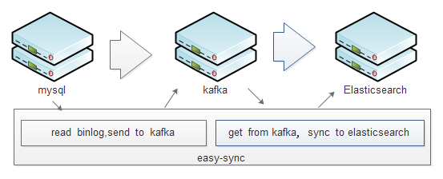
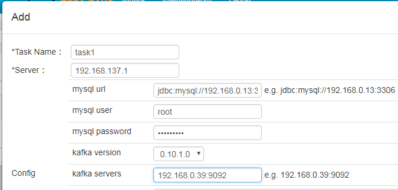
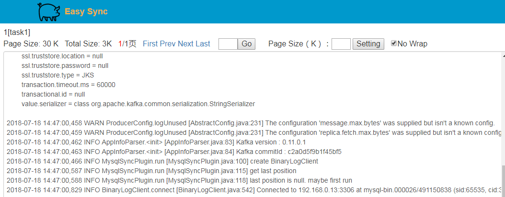
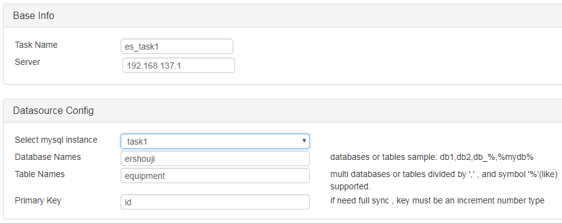
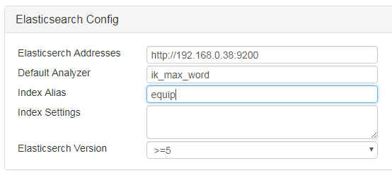

# easy-sync

Sync mysql to elasticsearch in real-time via binlog and kafka. 
- Easy to use.
- Support multi sync tasks without restart.
- Change index structure smoothly without affecting online business.


# How does it work?
There are two kinds of tasks.  
Binlog Task - Read binlog and send different tables' data to different kafka topics.  
Elasticsearch Task - Each task read own kafka topic and write data to elasticsearch. 



# Why use kafka?
mysql binlog records all tables changes one by one. When you sync two tables to es, 
one does not work will block another one. So we send two tables' data to kafka with different topics, 
two tables will work independently.
# Quick start
- Install jdk(>=1.8),  install kafka(>=0.9.0.1)
- download eays-sync from https://github.com/cehome-com/easy-sync/releases,   
 https://github.com/cehome-com/easy-sync/releases/download/2.0.5/easy-sync.zip 
 , unzip and run:  
  **java -jar easy-sync.jar**
- Visit http://localhost:8080
- Add and start binlog task, add and start elasticsearch task

# Add binlog task
- Mysql binlog config  
Before you can read mysql binlog, you have to enable binlog with Row mode,
 and grant REPLICATION privilege to your mysql user.  
1. enable mysql binlog.  

```
[mysqld]
log-bin=mysql-bin
binlog-format=ROW
server_id=1
```

2. create mysql user and grant REPLICATION privilege.

```
CREATE USER sync IDENTIFIED BY 'sync';  
GRANT SELECT, REPLICATION SLAVE, REPLICATION CLIENT ON *.* TO 'sync'@'%';
-- GRANT ALL PRIVILEGES ON *.* TO 'sync'@'%' ;
FLUSH PRIVILEGES;
```

- At home page, click "Add" button to open a dialog. Finish fields "Task Name, mysql url/user/password,
 kafka servers", click "Save" and "Close".  
 "Server"(which machine task runs on) field needn't edit, default value is your local ip such as
 "192.168.137.1"
 



- A binlog task is in list, click "Start". 


- Wait a minute, click "Log" button, a new window is opened and you can see some logs.
  But you have not added any elasticsearch tasks, binlog task will not send any data to kafka.
  You must continue to add elasticsearch task.
  


# Add elasticsearch task
- Click top menu "Elasticsearch" , click "Add" button to open a new window, configure "Base Info" and "Datasource Config".
  Task.  
  Select mysql instance: select the binlog task "task1" you have just configured.
  Database Names: existing databases such as "ershouji".
  Table Names: an existing table such as "equipment". If you have more than on tables such as 
  equipment_1,equipment_2 with the same structure, then use "equipment_%" or "equipment_1,equipment_2".
  Primary key: currently only support increase, number type (for full sync).
  


- Elasticsearch Config  
  Be careful to select elasticsearch version.
  


- Field Mapping. Mapping for mysql and elasticsearch fields. Just click "Auto Mapping" button, all fields
will be listed. You can delete or modify some fields.


- Click "Rebuild Index". This step will save config and create new elasticsearch index.
- Switch to home page, refresh the page. You can see the task created, click "Start" button.
- Wait a minute, click "Log" to see logs. By default, full sync and increase sync runs
together.


# FAQ
- mysql versions  
  binlog tools use https://github.com/shyiko/mysql-binlog-connector-java, so mysql 5.x or 8.x is supported.
- kafka versions  
  kafka client can use 0.9.0.1,0.10.1.0,0.11.0.1 three versions. Hight version kafka servers normally 
  support low version clients. So you kafka server must >= 0.9.0.1
- where does task config store in?  
  By default, task config stores in H2 database in user home such as C:\Users\xxx\easy_sync.  
  You can create application.properties in the same directory easy-sync.jar is in to change it.
  Mysql or h2 database is supported.
   ```
  task.datasource.driverClassName=org.h2.Driver
  task.datasource.url=jdbc:h2:tcp://localhost:9092/~/easy_sync;MODE=MYSQL
  task.datasource.username=sa
  task.datasource.password=
  ```  
- easy-sync cluster supports.  
  You must have more than one computer nodes such as 192.168.0.10 and 192.168.0.11.
  1.  At each node, create application.properties in the same directory easy-sync.jar is in ,
  add "cluster name" and "config storage datasource" to file.
  ```
  #cluster name , also is config table_name, default is easy_sync
  task.factory.name=easy_sync
  
  #config storage datasource, support mysql or h2 database
  task.datasource.driverClassName=com.mysql.jdbc.Driver
  task.datasource.url=jdbc:mysql://192.168.0.13:3306/sync?useUnicode=true&characterEncoding=utf8&allowMultiQueries=true
  task.datasource.username=xxxx
  task.datasource.password=xxxx
  ```
  2. start easy_sync at each node.
  3. configure you tasks. You can select which ip task runs on(set "server" to 192.168.0.10 
  or 192.168.0.11 )
  4. Once one node is down, it will auto switch to another node after a while ( You can see 
  server ip changing from 192.168.0.10 to 192.168.0.11, but after the node is up again, the ip will
  switch back)
  
-  Languages  
  English(en) and chinese(cn) is supported. Default is english, 
  Add "**language=cn**" to application.properties to enable chinese.

-  change web port   
  modify application.properties  
**server.port=8080** 
  
  


